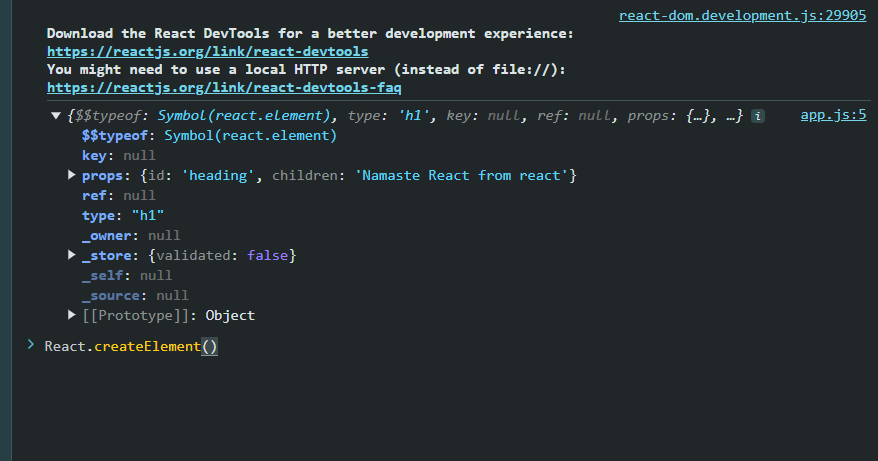

- what is cdn

- COre React thing 

<!-- Dom to make react work on web -->

diff type of places where react is used
- react 3d
- react native
- desktop

## Difference between react.development.js and react.production.js

- `react.development.js`: This is the development version of React. It includes helpful warnings and error messages to aid in debugging. It is not optimized for performance and should not be used in production.

- `react.production.js`: This is the production version of React. It is optimized for performance and does not include the extra warnings and error messages. This version should be used in production to ensure the best performance.

## What are async and defer

Both `async` and `defer` are boolean attributes that can be added to the `<script>` tag to control how scripts are loaded and executed.

- `async`: The script is executed asynchronously as soon as it is available. This means the script will be fetched in parallel to parsing the HTML, and will be executed as soon as it is downloaded, potentially before the HTML parsing is complete.

- `defer`: The script is executed after the HTML parsing is complete. The script is fetched in parallel to parsing the HTML, but it will only execute after the HTML parsing is done. This ensures that the script does not block the HTML parser.

## What is crossorigin in script tag?

The `crossorigin` attribute is used to handle Cross-Origin Resource Sharing (CORS) for the script. It can take three values:

- `anonymous`: This sends a request without credentials (cookies, HTTP authentication, and client-side SSL certificates).
- `use-credentials`: This sends a request with credentials.
- (empty string): This is the same as `anonymous`.

Using the `crossorigin` attribute ensures that the script is fetched with the appropriate CORS policy.